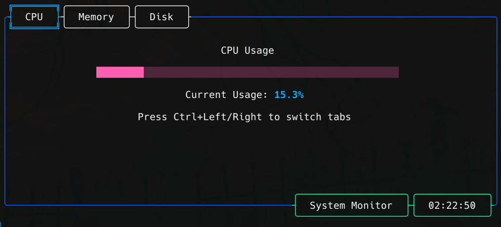
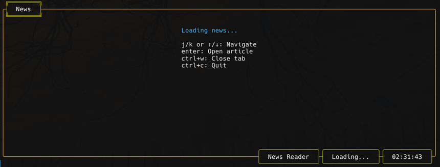

# Example usages of the `skeleton` package

This repository contains various example applications built using the `skeleton` package, demonstrating different use cases and features.

## 🚀 Available Examples

### 1. Basic Tab Example
A simple demonstration of creating tabs and widgets - perfect for getting started! 

**Features:**
- Basic tab management
- Simple widget creation
- Default key binding examples

**Controls:**
- `ctrl+left` / `ctrl+right`: Switch between tabs
- `ctrl+c`: Exit application

### 2. File Reader
A terminal-based file explorer and reader application.

**Features:**
- File system navigation
- File content viewing
- Tab management

**Controls:**
- `ctrl+left` / `ctrl+right`: Switch between tabs
- `ctrl+w`: Close current tab
- `ctrl+c`: Exit application

### 3. System Monitor
A real-time system resource monitoring application.

**Features:**
- CPU usage monitoring
- Memory usage tracking
- Disk usage statistics
- Real-time updates

**Controls:**
- `ctrl+left` / `ctrl+right`: Switch between tabs
- `ctrl+c`: Exit application

### 4. News Reader
A terminal-based RSS news reader application.

**Features:**
- RSS feed parsing
- News article viewing
- Multiple feed support
- Clean article formatting
- Tab-based navigation

**Controls:**
- `ctrl+left` / `ctrl+right`: Switch between tabs
- `ctrl+c`: Exit application

## 🔧 Getting Started

Each example is contained in its own directory and can be run independently. To try an example:

1. Navigate to the example directory
2. Run `go mod tidy` to ensure dependencies
3. Execute `go run .` to start the application

## 📝 Note
You can customize key bindings in all examples by modifying the configuration in the respective `main.go` files.

## 🤝 Contributing
Feel free to contribute more examples or improve existing ones through pull requests!